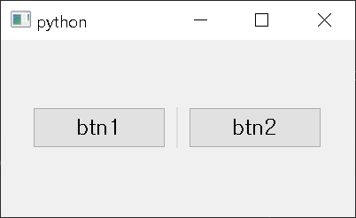
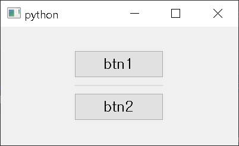
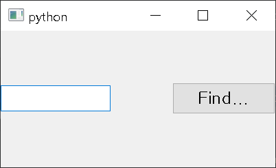
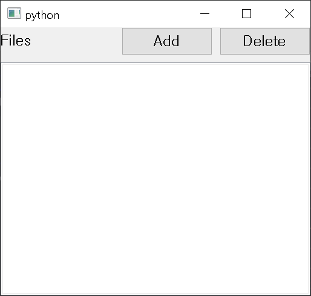
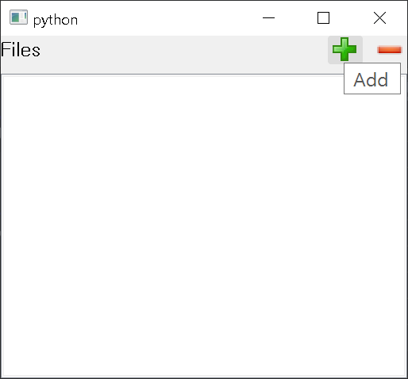

# simplePyQt5

## Table of Contents
* [General Info](#general-info)
* [Requirements](#requirements)
* [Class Overview](#class-overview)
* [Setup](#setup)
* [Usage](#usage)

## General Info
Being able to add a couple of Qt widgets and separator at once, align them easily, no need to make layout.
This package can come in handy to someone who want to make prototype UI quick.

## Requirements
* PyQt5

## Class Overview
* HorizontalWidget

Add widgets and separators horizontally.

* VerticalWidget

Add widgets and separators vertically.

* LeftRightWidget

Add some widgets left side of the widget and add the others right side.
Unlike QFormLayout which only can set QLabel to the one side, You can add a bunch of other stuffs like QComboBox, QCheckBox.

* TopLeftRightWidget

This module inherits LeftRightWidget.
Top of this widget is LeftRightWidget and bottom part of this you can add/set a bunch of widgets such as QListWidget or separators.

* TopLabelBottomWidget

If you want to add the label on the top of the TopLeftRightWidget, This is for you.
Using `setLabel(text: str)` method to set the label. 

* StyleApplier

This module help you apply style, icon, tooltip over widgets. Style path and icon path are set to `style` and `icon` folder in your script folder by default. So if you want to use this module you have to make those two and put the css files and icon files inside them.
You can change those two paths, though.

## Setup
```
$ pip install pyqt5 # if pyqt5 is not installed in your package library
$ pip install git+https://github.com/yjg30737/simplePyQt5.git
```

## Usage
* HorizontalWidget

Code
```python
    from simplePyQt5.horizontalWidget import HorizontalWidget
    ...
    horizontalWidget = HorizontalWidget()
    btn1 = QPushButton('btn1')
    btn2 = QPushButton('btn2')
    # Add two buttons horizontally, "''" between to buttons is separator, align parameter make widgets align
    horizontalWidget.addWidgets([btn1, '', btn2], align=Qt.AlignCenter)
```
Result



* VerticalWidget

Code

Same as HorizontalWidget. Only difference is name.

Result



* LeftRightWidget
```python
    from simplePyQt5.leftRightWidget import LeftRightWidget
    ...
    lrWidget = LeftRightWidget()
    lineEdit = QLineEdit()
    lineEdit.setFixedWidth(80) # Prevent width of lineEdit grow endlessly to show this modules feature
    btn = QPushButton()
    lrWidget.setLeftWidgets([lineEdit]) # Add lineEdit left side of the lrWidget
    lrWidget.setRightWidgets([btn]) # Add btn right side of the lrWidget
```
Result



* TopLeftRightWidget

As i said this inherits LeftRightWidget so its usage is kinda simillar to LeftRightWidget.

Code
```python
    from simplePyQt5.topLeftRightWidget import TopLeftRightWidget
    ...
    tlrWidget = TopLeftRightWidget()
    lbl = QLabel('Files')
    addBtn = QPushButton('Add')
    delBtn = QPushButton('Delete')
    listWidget = QListWidget()
    tlrWidget.setLeftWidgets([lbl])
    tlrWidget.setRightWidgets([addBtn, delBtn])
    tlrWidget.addBottomWidget(listWidget)
```
Result



* StyleApplier

Using TopLeftRightWidget as showing StyleApplier's feature.

Code
```python
    from simplePyQt5.styleApplier import StyleApplier
    ...
    tlrWidget = TopLeftRightWidget()
    lbl = QLabel('Files')
    addBtn = QPushButton()
    delBtn = QPushButton()

    btns = [addBtn, delBtn]
    applier = StyleApplier()
    applier.setCssFile('style1.css', btns) # apply css file to btns list 
    applier.setIconAutomatically(['add.png', 'delete.png'], btns) # apply icon files to btns list
    applier.setToolTip(['Add', 'Delete'], btns) # apply tooltips to btns list

    listWidget = QListWidget()
    tlrWidget.setLeftWidgets([lbl])
    tlrWidget.setRightWidgets([addBtn, delBtn])
    tlrWidget.addBottomWidget(listWidget)
```
Result



Again, Style path and icon path are set to `style` and `icon` folder in your script folder by default. So if you want to use this module you have to make those two and put the css files and icon files inside them.

You can change those two default paths with `setStylePath` and `setIconPath` method.

If you want to apply css code itself over widgets instead of file, use `setCssCode` method.

If you want to adjust widgets' size to icons' size naturally, use `setHintSize` method.

* TopLabelBottomWidget

Code(Full)
```python
import sys

from PyQt5.QtWidgets import QMainWindow, QPushButton, QApplication, QListWidget, QCheckBox
from simplePyQt5 import StyleApplier
from simplePyQt5.topLabelBottomWidget import TopLabelBottomWidget


class MainWindow(QMainWindow):
    def __init__(self):
        super().__init__()
        self.__initUi()

    def __initUi(self):
        mainWidget = TopLabelBottomWidget()
        mainWidget.setLabel('Files')

        allChkBox = QCheckBox('Check All')

        addBtn = QPushButton()
        delBtn = QPushButton()

        btns = [addBtn, delBtn]
        applier = StyleApplier()
        applier.setCssFile('style1.css', btns)
        applier.setIconAutomatically(['add.png', 'delete.png'], btns)
        applier.setToolTip(['Add', 'Delete'], btns)

        listWidget = QListWidget()
        mainWidget.setLeftWidgets([allChkBox])
        mainWidget.setRightWidgets([addBtn, delBtn])
        mainWidget.addBottomWidget(listWidget)
        lay = mainWidget.layout()
        lay.setContentsMargins(5, 5, 5, 5)
        self.setCentralWidget(mainWidget)


if __name__ == "__main__":
    app = QApplication(sys.argv)
    mainWindow = MainWindow()
    mainWindow.show()
    sys.exit(app.exec_())
```

* Other

These classes' content margins are set to zero as default, so if you want to set the margin then
```python
    lrWidget = LeftRightWidget()
    lay = lrWidget.layout()
    lay.setContentMargins(5, 5, 5, 5)
```
get the widget's layout like this and set content margins or anything such as spacing.
